## What are the server hardware specifications (virtual machine settings)? Take a screenshot - don’t type it!

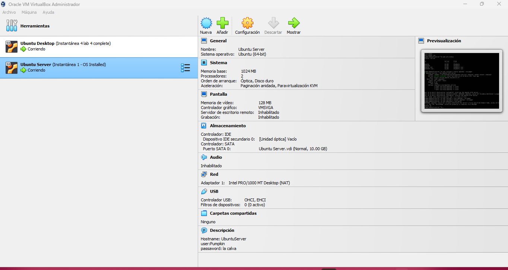
## What is Ubuntu server log in screen? Take screenshot - do not type it!
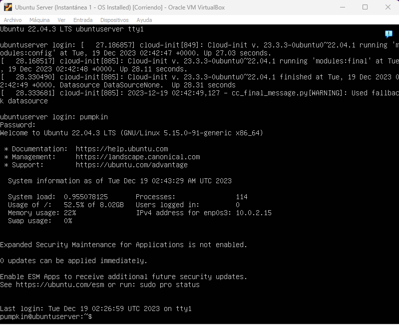

## What is the IP address of your Ubuntu Server Virtual Machine?
10.0.2.15
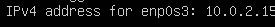

## How do you enable the Ubuntu Firewall?
sudo ufw enable
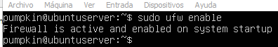

## How do you check if the Ubuntu Firewall is running?
sudo ufw status
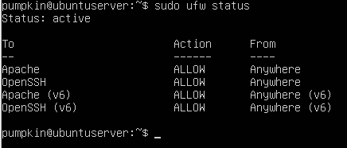

## How do you disable the Ubuntu Firewall?
sudo ufw disable
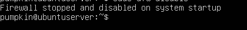

## How do you add Apache to the Firewall?
sudo ufw allow 'Apache'

## What is the command you used to install Apache?
sudo apt install apache2 -y

## What is the command you use to check if Apache is running?
sudo systemctl status apache2 --no-pager
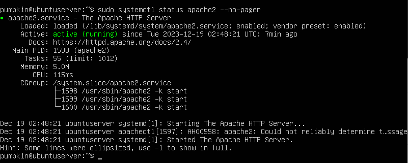

## What is the command you use to stop Apache?
sudo systemctl stop apache2 --no-pager

## What is the command you use to restart Apache?
sudo systemctl restart apache2 --no-pager
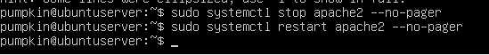

## What is the command used to test Apache configuration?
sudo apache2ctl configtest
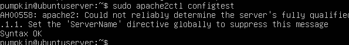

## What is the command used to check the installed version of Apache? 
apache2 -v
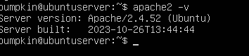

## Which are Apache Log Files, and what are they used for? Provide examples and screenshots.
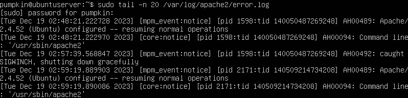
