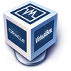
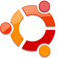

# Deliverable 1 Submission

## Basic Terminology

### What is Apache?
_Apache is an open source web server software. It is one of the most widely used web servers in the world, and is known for its stability and flexibility. It can be used to host websites, web applications, and other types of web based content._

### What is Web Server?
_A web server is a software or hardware system that stores, processes, and delivers web content (like web pages, images, or files)_

## What are some example web server applications?

| Application Name | License                                    | Project's Website         |
| ---------------- | ------------------------------------------ | ------------------------- |
| Apache           | Apache License 1.0 and Apache License 2.0. | https://httpd.apache.org/ |
| Caddy            | Apache License 2.0.                        | https://caddyserver.com/  |
| Nginx            | 2 clause BSD like                          | https://nginx.org/        |

#### Apache

_Apache is a robust and widely used open source web server software that plays a pivotal role in serving and delivering web content. It efficiently handles HTTP requests, making it the go to choice for hosting dynamic websites and applications. Apache remains a reliable foundation for web hosting, ensuring seamless connectivity and performance across the digital landscape._

#### Caddy

_Caddy is a cutting edge web server that stands out for its simplicity and powerful features. What sets Caddy apart is its automatic HTTPS configuration, providing secure connections by default. Caddy eliminates the complexity of manual certificate management._

#### Nginx

_Nginx stands as a high performance, open source web server and reverse proxy, delivering unparalleled speed and versatility. ts modular design allows for seamless integration of additional features, including load balancing and caching._

### What is virtualization?
_Virtualization is a technology that enables the creation of virtual instances or representations of computer resources, such as servers, storage, networks, and operating systems._

### What is virtualbox?

_VirtualBox is an open source hosted hypervisor developed by Oracle. It facilitates the creation and management of virtual machines on a single physical computer. This software supports a broad range of host operating systems, including Windows, macOS, Linux._

### What is a virtual machine?
 _A virtual machine is a software based emulation of a physical computer. It allows to run an operating system and applications on a virtualized environment._

### What is Ubuntu Server?

_Ubuntu Server is a versatile and secure operating system, offering stability, security, and community support. Whether hosting web servers, managing databases, or embracing cloud technologies._

### What is a firewall?
_A firewall is a critical component of network security designed to monitor, filter, and control incoming and outgoing network traffic based on predetermined security rules._

### What is SSH?

_SSH, or Secure Shell, is network protocol that facilitates secure communication over unsecured networks.used for remote command line login and secure file transfers, SSH ensures the confidentiality and integrity of data exchanged between two systems_

## Other Relevant Concepts

_Firewall: UFW (Uncomplicated Firewall) streamlines netfilter management, ensuring ease of use for controlling firewalls._

_Web Server: Apache, a free and open-source software, facilitates the deployment of websites on the internet._

_Multi domain Hosting: Through virtual hosting, a server efficiently shares resources like memory and processor cycles among various domain names, promoting flexibility without the necessity for uniform host names across all services._

