# Week Report 4

## Practice from the presentation The Linux File system: 
 
 ### Practice 1
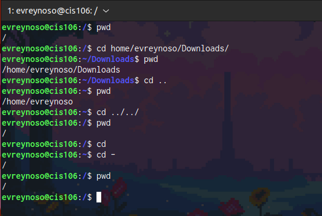

 ### Practice 2
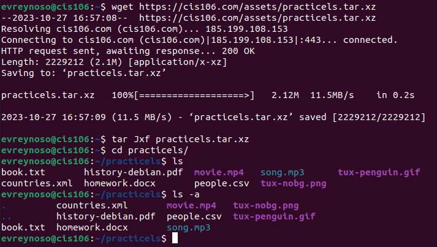
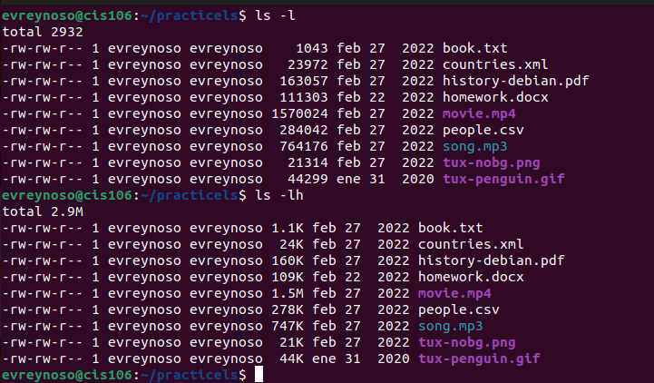
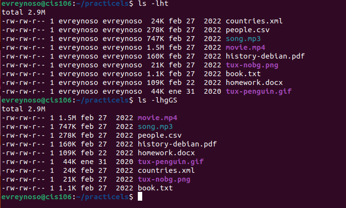
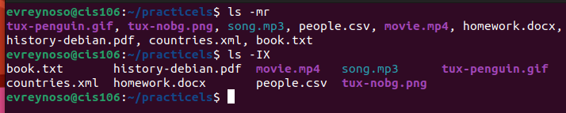

### Practice 3
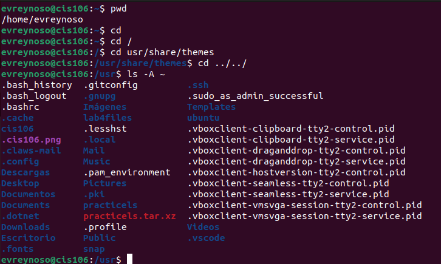
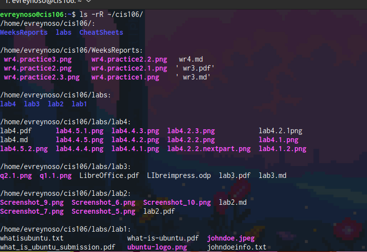
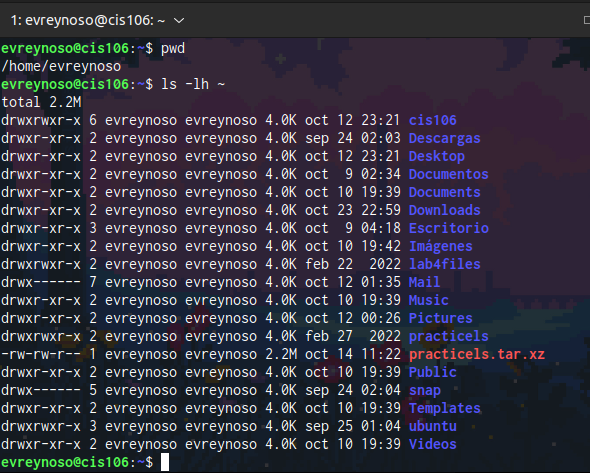
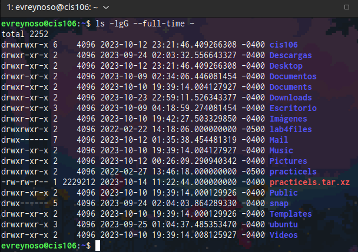

## The Linux File system directories and their purpose: 

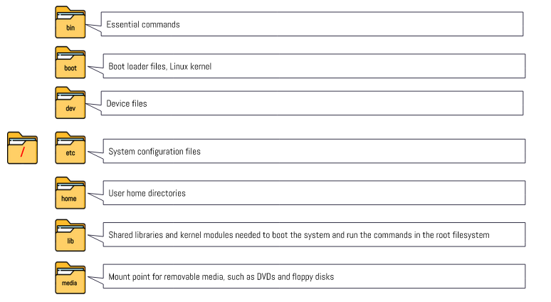
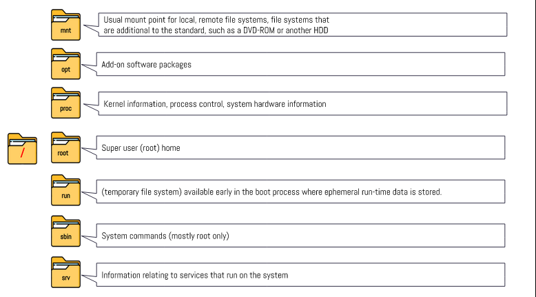

## All the commands for navigating the filesystem:

| Command | What it does                                                           | Syntax                     | Example       |
| ------- | ---------------------------------------------------------------------- | -------------------------- | ------------- |
| pwd     | Print the full filename of the current working directory.              | `pwd [OPTION]...`          | `pwd`         |
| cd      | Command for change directory.                                          | `cd Directory_name`        | `cd /home/`   |
| ls      | List information  about  the files (the current directory by default). | `ls [OPTION]... [FILE]...` | `ls -l /home` |

##  Basic terminology 

* **File system:** _The way files are stored and organized_

* **Current directory:** _is the directory where commands and file operations are currently executed in a file system._

* **parent directory:** _a directory that contains more folders subdirectories_

* **the difference between your home directory and the home directory:** _"Your Home Directory" refers to the home directory associated with the currently logged in user. and "The Home Directory" is a more general reference to the concept of home directories on the system_

* **pathname:** _a pathname is a string that specifies the location of a file or directory within the file system._

* **relative path:** _the location of a file relative to the current working directory_

* **absolute path:** _the location of a file or directory from the root directory_

