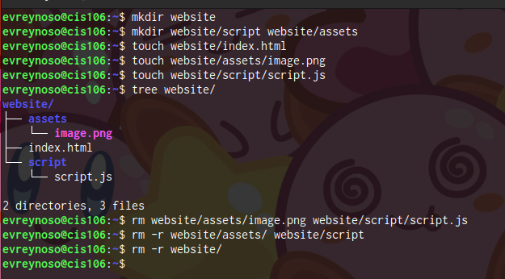
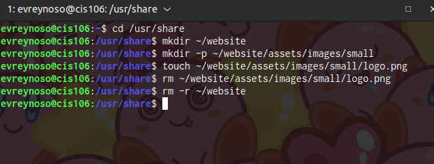
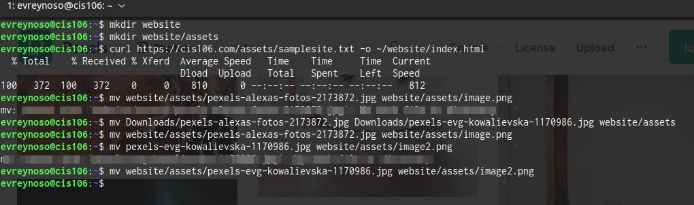
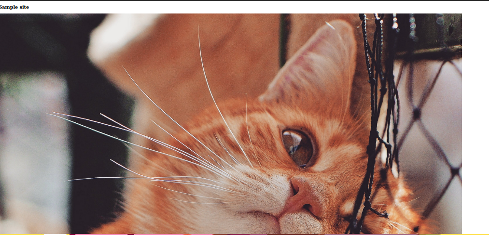
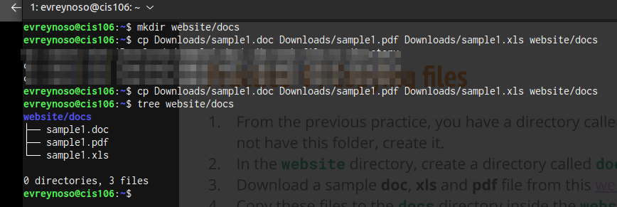

# Week Report 5

**What are Command Options?** 
_Modifies the operation of a command_

**What are Command Arguments?**
_File names or other data specified for a command to be used as input._

**Which command is used for creating directories? Provide at least 3 examples.**
 1. _mkdir documents_
 2. _mkdir /home/user/backup_
 3. _-p photos/images_

**What does the touch command do? Provide at least 3 examples.**
 1. _touch newfile.txt_
 2. _touch file1.txt file2.txt file3.txt_
 3. _touch existingfile.txt_

**How do you remove a file? Provide an example.**
To remove a file you can use the 'rm'
 1. _rm filename_
 2. _rm example.txt_

**How do you remove a directory and can you remove non-empty directories in Linux? Provide an example**
_rm -r for a non-empty directory._

**Explain the mv and cp command. Provide at least 2 examples of each**
 _The mv command is used to move files or directories from one location to another._
 **mv file.txt /path/to/new/location/**

_The cp command is used to copy files or directories from one location to another._
**cp sourcefile.txt /path/to/destination/**

## Practice 1

## Practice 2

## Practice 3

## Practice 4 

