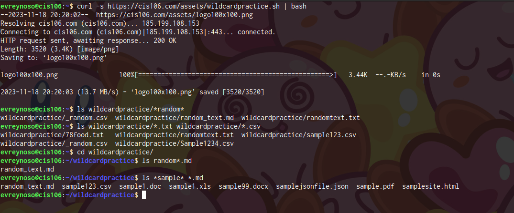
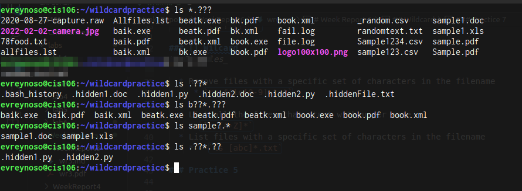
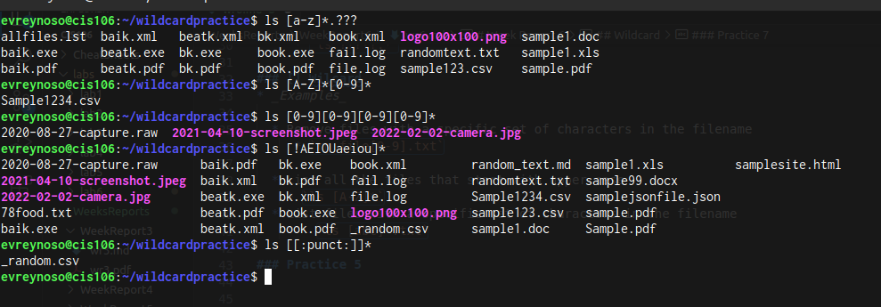

# Week Report 6 
## Wildcard

### * Wildcard

* _Examples_ 

  * List all files in the current directory 
     * `ls *`
  * List all files with a specific extension
     *  `ls *.txt`
  * List all files with a specific pattern
     *    `ls file*` 

### ? Wildcard
* _Examples_ 

  * List files with a single character filename
     * `ls ?`
  * List files with a specific extension and a single character filename
    * `ls *.?`
  *   List all the files that only has 5 characters before the extension 
     * `ls ?????.*`

### [] Wilcard
* _Examples_ 

  * Remove files with a specific set of characters in the filename
     * `rm file[0-9].txt`
     
  * List all the files that start with upper case
    * `ls [A-Z]*`
  * List files with a specific set of characters in the filename
    *   `ls [abc]*.txt`

### Practice 5

### Practice 6

### Practice 7

  

  ### Brace Expansion

*   _Brace expansion is useful for generating lists of strings with a common pattern._

    * Create multiple directories in a singular command 
      * `mkdir -p project/{src/{main,test}/{java,resources},bin,docs} `
     * Removing Specific Files
        * `rm file1.txt file2.txt file3.txt`
    *  Copy multiple files at the same time
       * `cp file1.txt file2.txt file3.txt /destination/directory/`
  
 
 

