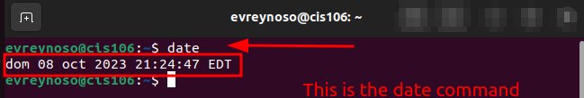
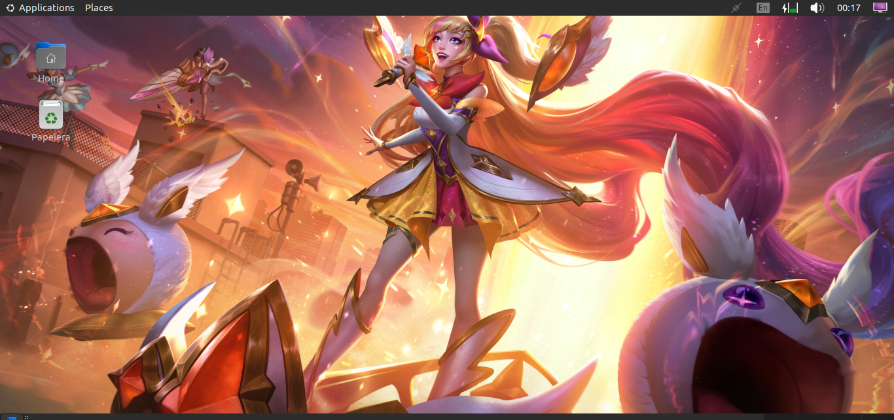

# Lab 3 Submission

## Question 1 

## Question 2 

## Question 3 

| Program purpose     | Package Name      | Version   |
| ------------------- | ----------------- | --------- |
| Play a tetris game  | Block Attack      | 2.7.0-1   |
| Play a video file   | Dragon Player     | 4:21.12.3 |
| Browse the internet | Ephiphany Browser | 42.4      |
| Read your email     | Claws Mail        | 4.0.0-3   |
| Play music          | Rhythmbox         | 3.4.4     |

## Question 4

| command | what it does                                                   |
| ------- | -------------------------------------------------------------- |
| echo    | display a line of text                                         |
| fortune | print a random, hopefully interesting, adage                   |
| cowsay  | speaking/thinking cow                                          |
| lolcat  | trainbow coloring effect for text console display              |
| figlet  | display large characters made up of ordinary screen characters |
| toilet  | display large colourful characters                             |
| rig     | Random Identify Generator                                      |