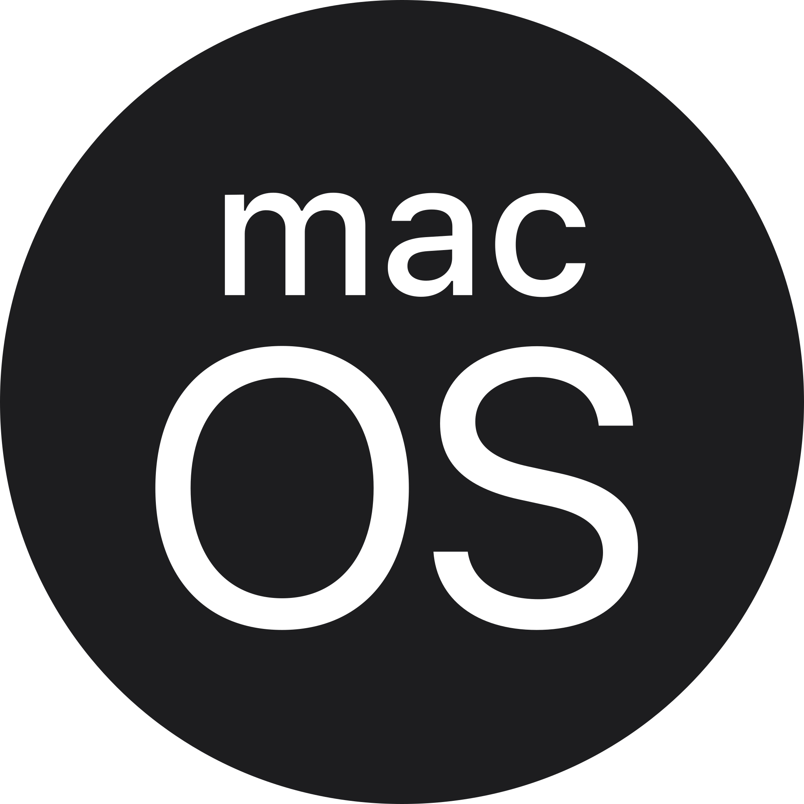

# What is GNU+Linux?
 GNU+Linux is an open source operating system renowned for its stability and efficiency. Widely used in servers and various systems, it thrives on a collaborative community.
# 3 Reasons to use GNU+Linux:
* Reason 1 GNU+Linux is open source, providing users freedom to customize and share software.
* Reason 2 Known for its stability, GNU+Linux excels in reliable performance, making it great for servers.
* Reason 3 GNU+Linux offers high flexibility, allowing users to personalize their computing experience.

# Other operating systems
* **Microsoft Windows** is a group of several proprietary graphical operating system families, all of which are developed and marketed by 
Microsoft. 

* **macOS** is a series of proprietary graphical operating systems developed and marketed by Apple Inc. 

* **FreeBSD** is a free and open-source Unix-like operating system descended from the Berkeley Software Distribution (BSD), which was based on Research Unix.

* **RISC OS** is a computer operating system originally designed by Acorn Computers Ltd in Cambridge, England. 
  