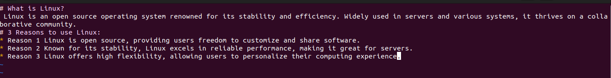
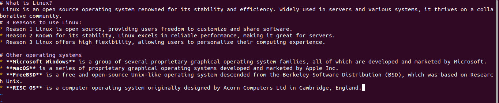
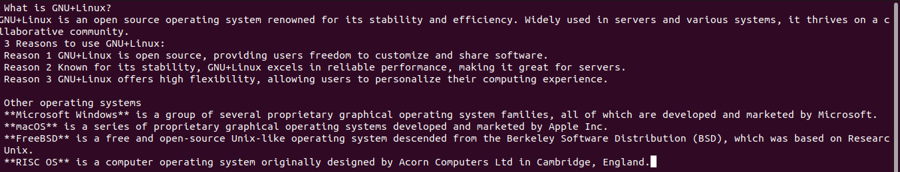

# Lab 8 

## Linux.md 

[linux.md](https://github.com/Viictoria31/cis106/tree/main/labs/lab8/linux.md)

## Linux+other.md

 

[linux+other.md](https://github.com/Viictoria31/cis106/tree/main/labs/lab8/linux+other.md)
## GNU+Linux.md

[linux+other.md](https://github.com/Viictoria31/cis106/tree/main/labs/lab8/GNU+Linux.md)

